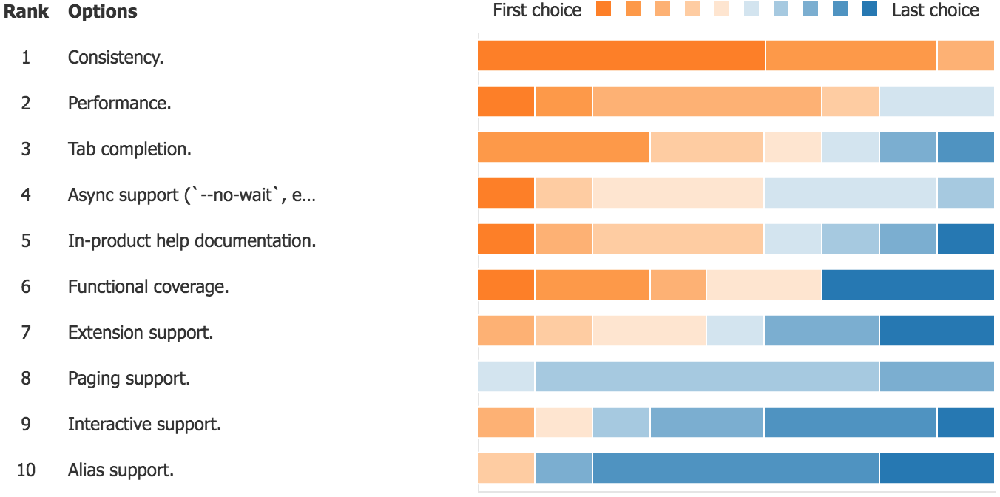

title: Azure CLI Customer Insights 2018
author: Aaron Roney
date: 2018-05-16 00:00:0
---
<!-- toc -->

# Azure CLI Customer Insights (201805)

## Survey Results

There were 19 customer responses to the survey.

### 1 For approximately how long have you been using Azure CLI?

The responses were fairly spread out.

| Answer           | Count |
|------------------|-------|
| Less than 1 year | 6     |
| 1 - 2 years      | 10    |
| Over 2 years     | 13    |

### 2 How likely is it that you would recommend Azure CLI to a friend or colleague (1 is the least, 10 is the most)?

The average rating was 8.00 with the following breakdown.

| Answer             | Count      |
|--------------------|------------|
| 1 - 6 (detractors) | 3 (15.78%) |
| 7 - 8 (neutrals)   | 8 (42.11%) |
| 9 - 10 (promoters) | 8 (42.11%) |

These results yield an approximate [**NPS**](https://en.wikipedia.org/wiki/Net_Promoter) of **26**.

### 3 What could Azure CLI change to make you more likely to recommend it?

The following are customer verbatims (bolding applied post):
* "**bash completion** working **faster**, more **coherency** between outputs type (tsv, table), verbose actualy [sic] doing something useful"
* "**Easier install**, less state management after login"
* "**Speed, tab completions** sometimes take a long time."
* "Easy to develop"

### 4 How would you rate the overall quality of Azure CLI (1 is the least, 10 is the most)?

The average rating was 7.95.

### 5 What could Azure CLI change to improve its overall quality?

The following are customer verbatims (bolding applied post):
* "it's **hard to debug problems**, it's **hard to kill the process** (I get it the command is still running on azure, but for Linus Torvalds sake, give me back the terminal when I press ctrl+c), there are a lot of incoherencies between longa and short params (like --resource-group --group -r -g depends on the module)"
* "Sometimes, the command name is not very accurate, align with functionality"
* "**Fewer bugs**, higher parity with what's possible with the REST API and ARM templates, better consistency between components and the CLI args used"
* "On-par with PowerShell. Develop in parallel, for aome features its hard to find (missing) from one or the other."
* "**Faster**"
* "Cli Explorer to find easy way to get function"

### 6 How well does Azure CLI meet your needs (1 is the least, 10 is the most)?

The average rating was 7.84.

### 7 What could Azure CLI change to help meet your needs better?

The following are customer verbatims (bolding applied post):
* "We don't have to replicate commands very often so often the GUI is more productive."
* "Enhance with Storage, CosmosDB, DataLakeStore etc. More into the services data-planes"

### 8 What current/future Azure CLI features are most important to you?

Customers were asked to rank certain features, and these were the results.

### 9 Please describe a new feature (e.g., alias support) or design (e.g., extension support) that recently delighted you in your experience with Azure CLI.

The following are customer verbatims (bolding applied post):
* "**extensions** will lead to faster developement of CLI itself so it's a good thing to make it modular, **aliases are fine**, however I'm affraid [sic] that will lead to mistakes and inter-community comunications [sic] problems"
* "aks"
* "Output formats"

### 10 Do you have any other recommendations, comments, questions, or concerns for the Azure CLI team?

The following are customer verbatims (bolding applied post):
* "Azure CLI is cool!!!"
* "still better than powershell ^^"
* "Please bring v2.0 Support across all services"
* "Any plans to allow a single command to authenticate without `az login`, e.g. `az --service-principal foo --password bar webapp list`?"

## Build Developer Day

### Hypothesis Types

* Customer: We believe that type of customers are motivated to motivation when doing job-to-be-done.
* Problem: We believe that type of customers are frustrated by job-to-be-done because of problem.
* Concept: We believe that concept will solve problem and be valuable to type of customers while doing job-to-be-done.  We will know this to be true when we see criteria.
* Feature: We believe type of customers will be successful solving problem using feature while doing job-to-be-done.  We will know they were successful when we see criteria.
* Business: We believe type of customers will realize business outcome by employing business action.  We will know this to be true when we see criteria.

## Customer Summary

## Next Steps

### Team Brainstorming

### Customer Interviews

### HCI Interviews