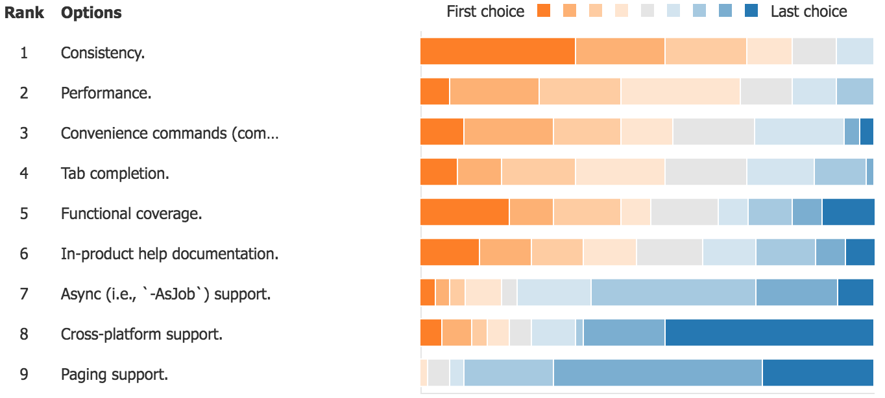

title: Azure PowerShell 2018
author: Aaron Roney
date: 2018-05-16 00:00:0
---
<!-- toc -->

# Azure PowerShell 2018

## Survey Results

There were 72 responses to the survey.

### 1 For approximately how long have you been using Azure PowerShell?

The responses were fairly spread out.

| Answer           | Count |
|------------------|-------|
| Less than 1 year | 6     |
| 1 - 2 years      | 17    |
| 2 - 3 years      | 18    |
| 3 - 4 years.     | 16    |
| Over 4 years     | 15    |

### 2 How likely is it that you would recommend Azure PowerShell to a friend or colleague (1 is the least, 10 is the most)?

The average rating was 8.86 with the following breakdown.

| Answer             | Count       |
|--------------------|-------------|
| 1 - 6 (detractors) | 2 (2.78%)   |
| 7 - 8 (neutrals)   | 26 (36.11%) |
| 9 - 10 (promoters) | 44 (61.11%) |

These results yield an approximate [**NPS**](https://en.wikipedia.org/wiki/Net_Promoter) of **58**.

### 3 What could Azure PowerShell change to make you more likely to recommend it?

The following are customer verbatims (bolding applied post):
* "Beter [sic] help with more examples"
* "**Documentation**"
* "There are a lot of opportunities to simplify the PowerShell commands while retaining the level of control that we expect when using it. Streamlining some of the **commands** so that they are **uniquely valuable** rather than mimicking the REST API would make it easier to adopt and therefore recommend."
* "Make Azure PowerShell embrace the **fundamentals** of what makes **PowerShell** so powerful"
* "**Simplified** AAD commands similar to `az ad sp create-for-rbac` [formatting added] would also be awesome."
* "Implement fixes given through GitHib issues."
* "Additional **tab complete** on resources"
* "Make it more interoperable with C# and make the **commands more discoverable**."
* "**Documentation** improvements. e.g. more examples."
* "**Documented** changes between releases and guidance how to migrate your scripts from one version to another."
* "More **consistency** across each of the modules. Some components like ASR are practically learning an entirely new component."
* "Improve the **documentation**, there is a lack of documentation and examples on many powershell cmdlets, this can sometimes make it difficult to work out how to correctly use some parameters"
* "**Consistency** improvements, less low-level, atomic commands, more high level commands, adhere to PowerShell standards."
* "I feel the key here is to ensure that **feature parity** for all areas is maintained for PowerShell over the cli/web gui."
* "Maintain **parity** with features/commands released with Azure CLI"

### 4 How would you rate the overall quality of Azure PowerShell (1 is the least, 10 is the most)?

The average rating was 8.22.

### 5 What could Azure PowerShell change to improve its overall quality?

The following are customer verbatims (bolding applied post):
* "**DOCUMENTATION** OF COMMANDLETS. Some teams are great in documenting their commandlets. Others don't do it at all."
* "Commandlet **inconsistency** is one of the most **frustrating** parts (parameters within and between modules don't always use the same naming, for example)"
* "**examples** and **docs** for everything"
* "More accurate/complete help **documentation**. Better examples of how some commands relate to each other so that examples are more effective."
* "More **testing**. There are a lot of commands that only partially support the services features. Often they fail in unexpected ways and often there's no easy way to pipe commands together when it would be expected."
* "**make it easier** and **less typing** (make complex tasks simpler) better support for jobs"
* "Improve **documentation**."
* "Pretty good as is"

### 6 How well does Azure PowerShell meet your needs (1 is the least, 10 is the most)?

The average rating was 8.56.

### 7 What could Azure PowerShell change to help meet your needs better?

The following are customer verbatims (bolding applied post):
* "There are functionalities which are available only via CLI"
* "Be more **efficient** in terms of commands. One easy example: If I'm creating a VM, then I need a NIC and obviously a VNET. The VNET has a location so why do the NIC/VM/disk/etc all also mandate separate prompts for location?"
* "More **consistency** - lots of per-service differences between Update- and Set- operations."
* "More **examples** and better explainantions [sic] on how the exampels [sic] work."
* "**Simplify** some actions"
* "Better and conplete [sic] support for **PowerShell core**."
* "**Auto upgrade** of commandlets"

### 8 What current/future Azure PowerShell features are most important to you?

Customers were asked to rank certain features, and these were the results.

### 9 Please describe a new feature (e.g., create VM convenience cmdlets) or design (e.g., -AsJob support) that recently delighted you in your experience with Azure PowerShell.

The following are customer verbatims (bolding applied post):
* "The simplified `New-AzureRmVM` command was a great addition (creating a VM with one command)"
* "`-AsJob` for sure and the **tab completion** for things like resource groups etc"
* "`-asjob` support is great!"
* "**AKS**"
* "Getting `Connect-AzureRmAccount` and `Disconnect-AzureRmAccount` in place instead of other poor command names."
* "definitely `-AsJob`!"
* "Parameter **completion**"

### 10 Do you have any other recommendations, comments, questions, or concerns for the Azure PowerShell team?

The following are customer verbatims (bolding applied post):
* "keep up the good work. More public / customer engagements to put the word out."
* "Good job!"
* "Doing a great job, PowerShell in Azure makes life so much easier!"
* "Thank you"
* "The PowerShell team is awesome!"
* "Convenience command seem fine but a pattern that allows conposavility [sic] is important when doing that"
* "Please, where there is a portal action build this in PowerShell also. Recent experience we here this hasn’t been the case in setting default OMS workspace in ASC"

## Build Developer Day

### Hypothesis Types

* Customer: We believe that type of customers are motivated to motivation when doing job-to-be-done.
* Problem: We believe that type of customers are frustrated by job-to-be-done because of problem.
* Concept: We believe that concept will solve problem and be valuable to type of customers while doing job-to-be-done.  We will know this to be true when we see criteria.
* Feature: We believe type of customers will be successful solving problem using feature while doing job-to-be-done.  We will know they were successful when we see criteria.
* Business: We believe type of customers will realize business outcome by employing business action.  We will know this to be true when we see criteria.

### Problem: We believe Azure Powershell customers are frustrated by the rollup package because it is getting too big and unwieldy.

**Invalidated**: customers are not frustrated by the number of modules or the size, in general, but they are frustrated by an inability to sift through the documentation and cmdlets to find the specific cmdlets they need.

### Problem: We believe Azure PowerShell customers encounter difficulty when using documentation in Azure PowerShell because: (a) bad in-product samples, (b) too many commands, (c) too flat of structure, (d) poor search capabilities, etc.

**Validated**: customers generally report an inability to reach a workable solution in the product or documentation alone, and they typically go somewhere like Stack Overflow for quick solutions.

* Most customers continue to use Google, then StackOverflow.
* In-product documentation is lacking, leading to customers using Google, etc.
* Hard to figure out what the cmdlet is that I want in PowerShell."
* "I want one place where I can discover all of this [i.e., convenience commands]; I just need the example."

### Problem: We believe Azure PowerShell customers want even more convenience commands, and they want them to extend to `Update-` scenarios.

**Validated**: customers continue to show high interest in improvements to cmdlet and overall product convenience.

* Customers want more convenience.
* Resource group convenience commands.
* Some comments about mor Monitor, Storage, Cognitive Services, and CosmosDb support.
* More tab completion.

### Problem: We believe that customers are disheartened when documentation and samples prioritize Azure CLI.

**Validated**: customers, especially those steeped in PowerShell, find the lack of service documentation for Azure PowerShell concerning, as most of the documentation is tailored to Azure CLI, by default.  Azure PowerShell seems like an after-thought in service team documentation.

* "it seems like Azure CLI is the thing everything is always used."
* "I'm not even sure if Azure PowerShell exists anymore"
* "I use Azure CLI because that's what the docs tell me to use" 
* "there are many things that seemed to cause it to be installed"

## Next Steps

### Team Brainstorming

* Customer Hypotheses:
    * Customers are using versions that are so old, they are unaware of sovereign cloud issues.
* Problem Hypotheses:
    * Customers are frustrated with lacking support for sovereign cloud management.
    * Customers are frustrated when using a machine with multiple AzureRM versions installed due to version loading precedence in PowerShell.
* Brand New Features:
    * `Start-AzureRmCommandCenter`: like dashboard for Portal, but like `htop`.
    * Fuzzy search for command names and command descriptions in cmdlet form, maybe `Find-AzureRmCommand`.
    * Cross-service providers with awesome `ls`ing (e.g., `ls` in a vnet could actually list resources attached to the vnet).
* Improvements:
    * Resource Id completers, and "linked" completers between the pieces of a resource Id.
    * `My-Cmd -ResourceGroupName rg -Name name` => `My-Cmd -Id rg/name`.
        * We need questions to tease out what customers would want here.  "Validated hypothesis is that it sucks to work with Ids and their component parts".
    * [In response to above hypothesis] Azure PowerShell should have "stub" cmdlets after breaking changes when cmdlets are removed to notify customers.
    * Convenience cmdlets with high level of specificity (e.g., `New-AzureRmWindowsVm`).
    * Better alias strategy: that is, come up with an "alias formula" that is consistent (e.g., but not limited to, `Get-AzureRmVM` => `gazvm`).
* Infrastructure:
* Documentation:
    * Stack Overflow Day.
    * Ensure that we have good reference examples.
    * Ensure that we have good service team PowerShell documentation (from customer feedback).
    * Up-to-date model documentation to go along with reference documentation.
    * Start a medium blog series that actually works.
    * Add aliases to documentation (this should _possibly_ be done the right way [e.g., with PowerShell/PlatyPS cooperation]).
* Telemetry:
* VS Code / Cloud Shell:
* PowerShell Core:
    * `Install-Module` hook for `OnInstallScript`.
    * There should be an actually good `Uninstall-Module`.
    * There should be an actually good `Update-Module`.
    * There should be some notification system for `PowerShellGet` that informs user of updates to modules.
    * Work with PowerShell team to "bless" third party utilities that make the customer experience better.
    * `Verb-Noun` continues to be the worst syntax on the planet: plz fix.
* Azure Automation:
    * Better versioning/upgrading in Azure Automation: get rid of older versions.

### Problem/Concept Interviews

June 2018.

### HCI/Feature Interviews

September 2018.

## Titanium Themes

**Azure PowerShell Team to provide feedback on the theme titles, and I will fill them in.**

All items here are _themes_: i.e., specific items are pending customer feedback.

### 1 Realization of `Az`

Theme Ideas:
* NET Standard module.
* Doc updates.
* Aliases to old cmdlets.

#### `Az` Plan

* Ship new rollup package (i.e., `Az`) and cmdlet names (e.g., `New-AzVm`).
* New modules will be built against **NETStandard 2.0+** for **PowerShell 6** and PowerShell 5.1 Compatibility.
* **Refactoring** of **module layout** for better consistency and conciseness.
* All cmdlets will have `Az` => `AzureRM` aliases for _at least_ one year.
* Planning to ship end of **August 2018**.
* Awareness/Announcements
    * Talk about the move in June **Community Standup**.
    * Add a notice to landing page for **Azure PowerShell Conceptual Docs**.
    * **Blog post** at ship time.
    * `AzureRM` will still be usable.
* `AzureRM` Deprecation
    * `AzureRM` will be usable, but not developed.
    * Critical fixes only.
    * **Visual Studio** will need to be notified and upgraded.
    * **Automation** will need to be notified and upgraded.
    * **Azure Stack** will need to be notified and upgraded.
* Documentation
    * **All** Azure PowerShell Reference and Conceptual Documentation must be updated.
    * **Profile**, **ARM**, and **Compute** Docs to be updated without exception.
    * All other service teams should be updated at the direction of the doc team to the greatest extent possible.

### 2 Customer Engagement

Theme Ideas:
* Increase Customer Interviews.
* Problem, Concept, and Feature Hypothesis Testing.
* Community Standup Engagement.

### 3 Feature/Cmdlet Discovery

Theme Ideas:
* Possibly invest in a command similar to `az find`?
* Feature broadcasts in product.
* Aladdin integration.

### 4 Documentation

Theme Ideas:
* Service team documentation needs to cover Azure PowerShell.
* Stack Overflow Day.
* More examples in command reference.
* Better documentation of features (e.g., `-AsJob`, tab completion, etc.).

### 5 Convenience and Consistency

Theme Ideas:
* Autogeneration of CRUD operations.
* Monitor convenience commands.
* A command that has a "dashboard" (similar to Portal Dashboard, but selected vis monitor commands in terminal).