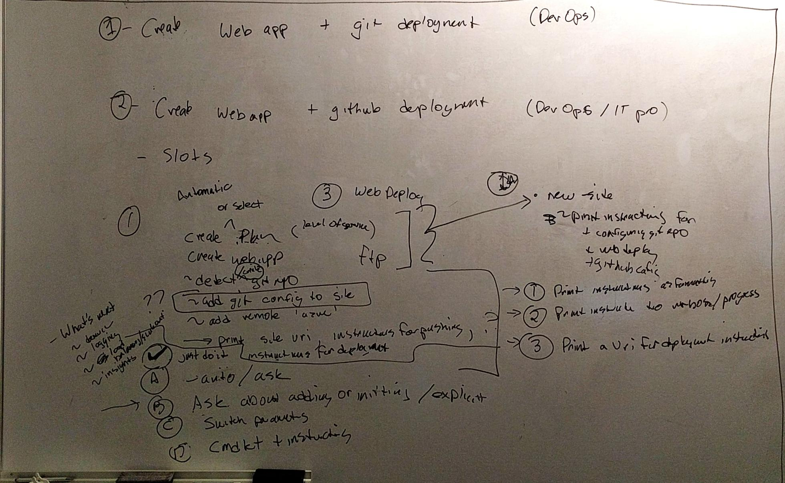

title: Azure PowerShell Strategy
author: Aaron Roney
date: 2017-05-14 21:52:13
---
<!-- toc -->

> What are killer demos for Azure PowerShell?  How do we get there?

## Introduction

As the de facto standard for Azure automation scenarios, Azure PowerShell is ubiquitous in its penetration of the cloud market.  This penetration means that all services across Azure must provide their users with workable Azure PowerShell cmdlets.  Historically, Azure PowerShell was largely owned by a single team; however, over time, the model for Azure PowerShell has become a "hub and spoke", where the Azure PowerShell feature team provides repositories, guidelines, static analysis, reviews, build tools, and publish tools, and service teams own the design and functionality of their cmdlets.  This model functions well, and it is within this model that Azure PowerShell successfully cemented itself as the de facto standard for Azure automation scenarios.

Through the years of this "hub and spoke" model, Azure PowerShell became, for all intents and purposes, a "mature" product.  We say this because most of the practices, guidelines, and processes have been in place and well-oiled for quite some time.  Its maturity has brought high usage and a solid customer base.  However, this maturity and stable complacency comes at a cost to investment in innovation.

Azure PowerShell has become somewhat of a "second thought" to service teams; however, the recent emphasis on Azure CLI 2.0 by management has led this team and others to re-evaluate the value of Azure PowerShell and its place in the each resource provider's lifecycle.  It is with this renewed emphasis on developer tools (especially CLIs) in Azure that our team hopes to accomplish drastic improvements to the Azure PowerShell experience.  This document will view other cloud platforms and Azure CLI 2.0 itself as competitors in an effort to properly determine how Azure PowerShell stacks up with the innovations of other CLIs (both internal and external).

## Investment Areas

| Investment                                    | Goal | Scenarios                                                                                                                                                                                                                | Priority | Cost Type      |
|-----------------------------------------------|------|--------------------------------------------------------------------------------------------------------------------------------------------------------------------------------------------------------------------------|----------|----------------|
| Cmdlet Modernization, Reduce Barrier to Entry | TBD  | Shorten cmdlet and parameter names which will improve script readability and tab completion scenarios.                                                                                                                   | 1        | Dev            |
|                                               |      | Improve smart defaults to enable users to work through scenarios (especially creation scenarios) with greater ease.  This includes product-wide defaults and environment-specific defaults.                              | 0        | Dev            |
|                                               |      | Improve creation scenarios by redesigning cmdlets with common scenarios in mind.  This includes interactive experiences, directed experiences and lower overall barrier to entry via the aforementioned improvements.    | 1        | PM, Dev        |
|                                               |      | Improve utility by providing directed output for users.  That is, ensure users are aware of “common next steps” by providing output which directs users towards those common subsequent tasks.                           | 2        | PM, Dev        |
|                                               |      | Approach consistency in the low complexity of scenarios by converging on a ”mostly shared” ARM template layer with Azure CLI.                                                                                            | 1        | PM, Dev        |
| Ecosystem Support                             | TBD  | Convert all of the AzureRM modules to PowerShell Core (via the Azure SDK for .NET Core).  This enables key scenarios which the PowerShell Core team is attempting to deliver, and allows for AzureRM usage on Mac/Linux. | 0        | Dev            |
|                                               |      | Support Azure Stack scenarios with improvements to the Profile system.                                                                                                                                                   | 1        | Dev            |
|                                               |      | Support the Consistent Cloud in Azure PowerShell Integration in Cloud Shell by providing improvements (such as .NET Core support) which ensure key scenarios in the browser.                                             | 1        | Dev            |
| Engineering Improvements                      | TBD  | Improve documentation and samples, along with the planned product improvements, to empower users in their engineering efforts.                                                                                           | 2        | PM, Docs       |
|                                               |      | Manage issues and improvements in GitHub by fixing or closing issues within a specified time period SLA.  We will first cleanup existing issues to achieve a well-known state.                                           | 1        | PM, Management |
|                                               |      | Author reporting tools which supply common statistics (e.g., issue close rate, documentation quality, etc.) to partner teams.                                                                                            | 2        | PM, Dev        |
| Awareness                                     | TBD  | Make telemetry improvements which will paint a consistent picture across Azure developer tools and drive meaningful insight into how our product changes impact our customers.                                           | 2        | PM, Dev        |
|                                               |      | Engage the community by publishing community standups, regular tutorial videos, and interviews with team members.                                                                                                        | 1        | PM             |

## Compete

### Azure PowerShell

Create VM.<a name="createVmOld"></a>

```powershell
# Variables for common values
$ $resourceGroup = "myResourceGroup"
$ $location = "westeurope"
$ $vmName = "myVM"

# Create user object
$ $cred = Get-Credential -Message "Enter a username and password for the virtual machine."

# Create a resource group
$ New-AzureRmResourceGroup -Name $resourceGroup -Location $location

# Create a subnet configuration
$ $subnetConfig = New-AzureRmVirtualNetworkSubnetConfig -Name mySubnet -AddressPrefix 192.168.1.0/24

# Create a virtual network
$ $vnet = New-AzureRmVirtualNetwork -ResourceGroupName $resourceGroup -Location $location -Name MYvNET -AddressPrefix 192.168.0.0/16 -Subnet $subnetConfig

# Create a public IP address and specify a DNS name
$ $pip = New-AzureRmPublicIpAddress -ResourceGroupName $resourceGroup -Location $location -Name "mypublicdns$(Get-Random)" -AllocationMethod Static -IdleTimeoutInMinutes 4

# Create an inbound network security group rule for port 3389
$ $nsgRuleRDP = New-AzureRmNetworkSecurityRuleConfig -Name myNetworkSecurityGroupRuleRDP  -Protocol Tcp -Direction Inbound -Priority 1000 -SourceAddressPrefix * -SourcePortRange * -DestinationAddressPrefix * -DestinationPortRange 3389 -Access Allow

# Create a network security group
$ $nsg = New-AzureRmNetworkSecurityGroup -ResourceGroupName $resourceGroup -Location $location -Name myNetworkSecurityGroup -SecurityRules $nsgRuleRDP

# Create a virtual network card and associate with public IP address and NSG
$ $nic = New-AzureRmNetworkInterface -Name myNic -ResourceGroupName $resourceGroup -Location $location -SubnetId $vnet.Subnets[0].Id -PublicIpAddressId $pip.Id -NetworkSecurityGroupId $nsg.Id

# Create a virtual machine configuration
$ $vmConfig = New-AzureRmVMConfig -VMName $vmName -VMSize Standard_D1 | Set-AzureRmVMOperatingSystem -Windows -ComputerName $vmName -Credential $cred | Set-AzureRmVMSourceImage -PublisherName MicrosoftWindowsServer -Offer WindowsServer -Skus 2016-Datacenter -Version latest | Add-AzureRmVMNetworkInterface -Id $nic.Id

# Create a virtual machine
$ New-AzureRmVM -ResourceGroupName $resourceGroup -Location $location -VM $vmConfig
```

Create and deploy web app.

```powershell
$ $gitdirectory="<Replace with path to local Git repo>"
$ $webappname="mywebapp$(Get-Random)"
$ $location="West Europe"

# Create a resource group.
$ New-AzureRmResourceGroup -Name myResourceGroup -Location $location

# Create an App Service plan in `Free` tier.
$ New-AzureRmAppServicePlan -Name $webappname -Location $location -ResourceGroupName myResourceGroup -Tier Free

# Create a web app.
$ New-AzureRmWebApp -Name $webappname -Location $location -AppServicePlan $webappname -ResourceGroupName myResourceGroup

# Configure GitHub deployment from your GitHub repo and deploy once.
$ $PropertiesObject = @{
    scmType = "LocalGit";
}
$ Set-AzureRmResource -PropertyObject $PropertiesObject -ResourceGroupName myResourceGroup -ResourceType Microsoft.Web/sites/config -ResourceName $webappname/web -ApiVersion 2015-08-01 -Force

# Get app-level deployment credentials
$ $xml = (Get-AzureRmWebAppPublishingProfile -Name $webappname -ResourceGroupName myResourceGroup -OutputFile null)
$ $username = $xml.SelectNodes("//publishProfile[@publishMethod=`"MSDeploy`"]/@userName").value
$ $password = $xml.SelectNodes("//publishProfile[@publishMethod=`"MSDeploy`"]/@userPWD").value

# Add the Azure remote to your local Git respository and push your code
#### This method saves your password in the git remote. You can use a Git credential manager to secure your password instead.
$ git remote add azure "https://${username}:$password@$webappname.scm.azurewebsites.net"
$ git push azure master
```

### Azure CLI 2.0

Create VM.

```bash
$ az group create -n MyRg -l WestUS
$ az vm create -n MyVm -g MyRg --image UbuntuLTS
```

Create and deploy web app.

```bash
$ az group create -n MyRg -l WestUS
$ az appservice plan create -n MyWebAppPlan -g MyRg
$ az appservice web create -n MyWebApp -g MyRg -p MyWebAppPlan
$ url=$(az appservice web source-control config-local-git --name $webappname --resource-group myResourceGroup --query url --output tsv)
$ git remote add azure $url
$ git push azure master
```

### GCloud

Create a VM.

```powershell
$ config = New-GceInstanceConfig "webserver-1" -MachineType "n1-standard-4" -DiskImage (Get-GceImage -Family "windows-2012-r2")
$ config | Add-GceInstance -Project MyRg -Zone "us-central1-b"
```

No good web app story for PowerShell.

### AWS

Create a VM.

```powershell
$ New-EC2Instance -ImageId ami-c49c0dac -MinCount 1 -MaxCount 1 -KeyName myPSKeyPair -SecurityGroups myPSSecurityGroup -InstanceType t1.micro
```

No good web app story for PowerShell.

### Heroku

Create a web app.

```bash
$ heroku create

Creating falling-wind-1624... done, stack is cedar-14
http://falling-wind-1624.herokuapp.com/ | https://git.heroku.com/falling-wind-1624.git
Git remote heroku added

$ git push heroku master
```

### Zeit Now

Create a web app.

```bash
$ now

> Deploying ~/OneDrive/Projects/simpleStaticSiteTest
> Using Node.js 7.7.3 (default)
> Ready! https://simplestaticsitetest-vredymcymy.now.sh (copied to clipboard) [1s]
> Initializing…
> Building
> ▲ npm install
> ⧗ Installing:
>  ‣ serve@5.0.4
> ✓ Installed 178 modules [9s]
> ▲ npm start
> > simpleStaticSiteTest@ start /home/nowuser/src
> > NODE_ENV='production' serve ./content
> Deployment complete!
```

## Proposed Areas of Improvement

These areas of improvements were selected based on key differentiators in competing products.  For example, Azure CLI 2.0 has made a point of basing commands on _scenarios_ rather than _API surface area_; in addition, they have chosen a number of smart defaults which make "getting started" scenarios easier for end uers.

The team came up with some key scenarios for design improvements.



### Core Improvements

The subsequent improvements are generally regarded as "common sense", and very little experimentation is needed to move forward in implementing these updates.

### Scenario-based Cmdlets

**All** cmdlets should be designed around scenarios, not the Azure REST service.

#### Shorter Names

This includes the names of cmdlets (e.g., `New-AzureRmVM` => `New-AzVm`) and the names of parameters (e.g., `-ResourceGroupName` => `-Rg`).  **To ensure compatibility, and reduce breaking changes, new cmdlets should have aliases to the "old" cmdlets; in addition, they should share _backwards compatible_ parameter sets.**

#### Smart Defaults

We will explore defaulting almost everything.  Popular defaults in competing products:
* Resource Group.
* Location.
* Dependent resources.

### Experimental Improvements

The subsequent improvements present several significant paradigm shifts which the team will validate and improve upon via experimentation.

#### Simple types

Create scenarios should move away from complex types and config objects.  For example, the current "create VM" scenario requires the user to set up lots of objects that could be simplified down to one or two parameters.

#### "Just Do It"

All create scenarios implementing "just do it" would have _no_ required parameters: all necessary information would be chosen by Azure PowerShell in an opinionated fashion.

#### Gray Parameters

In many cases, some parameters could be "gray" or semi-optional.  That is, if the parameter is not specified, the user is asked if we should generate the parameter for them.  For example, resource group is required for almost all _create_ scenarios; however, users often want to create a resource without much concern for a specific group (especially during REPL use).  As such, resource group would be a "gray" parameter that is provisioned for the user with a random name if they choose to leave it off.

It also makes sense for gray parameters to infer a value based on context with the user's consent.  For example, if the user has used a certain resource group for the last few cmdlets, it may make sense to have the gray parameter suggest the most recently used resource group (as opposed to recommending that the user create a new one).

#### `-Auto` Switch

This is an alternative posited in response to the fact that "gray" parameters are equivalent to the oxymoronic phrase "required parameter with a default".  In this case, `New-AzVm` would normally require that `-Name`, `-Image`, and `-Rg` be provided.  The `-Auto` switch would provide an "opt-in" way for users to _default all the things_ while maintaining the integrity of required parameters in the mainline path.

#### Feature-Specific Switches

This would be similar to `-Auto`, but would be meant for specific scenarios.  For example, the "Create web app" scenario might have a `-Git` or `-AddRemote` switch which would automatically add an "azure" remote to an existing git repository.

#### Settable Defaults

Users should have the ability to default certain ubiquitous parameters like `-ResourceGroupName` and `-Location`.

#### Size Defaults

Resource "sizes" can be confusing to users since many RPs use different names (e.g., "Standard_DS1_v2" or "S1"); however, it may be asserted that users care most about cost.  With this in mind, it may make sense to define "universal" sizes.  For example, it may make sense to provide t-shirt sizes that follow a price structure.

* XS: under $10/month.
* S: under $30/month.
* M: under $50/month.
* L: under $100/month.
* XL: udner $200/month.

Using these size, a user can let Azure PowerShell choose the _best option_ based on the resource they need and the budget.  Users, however, could still specifiy a specific size if they so chose.

This could also be achieved by, instead, giving the user the option to pass a "maximum dollar amount per month"; subsequently, Azure PowerShell would choose the best fit at the particular price point.

#### Output Format

Azure PowerShell currently returns `PSObject`s (in general), and there is normally very little console output.  However, many of the proposed designs make smart decisions on behalf of the user.  Despite the fact that console output is not a core paradigm of PowerShell, Azure PowerShell may need to display some information to the user regarding defaults, etc.

### Other

Parameter types:
* Required: e.g., name.
* Gray: e.g., resource group.
* Optional: e.g., VM size.

Other strategy ideas:
* Prompts for "gray" parameters.
* Generate script cmdlets.
* Better preview module support.
* Push logic server side.
* Rename "AzureRM" to something else (sort of goes with shorter cmdlet names).

## Killer Demos

### Create VM

In this sample, we automate all choices for the user without any prompting.

#### With Simple Types

In this sample, we create the proper types out of the simple types that the user passes.  For example, the `-AddressPrefix` parameter results in a new VNET with subnet of the specified address prefix.

```powershell
$ Login-AzAccount
$ New-AzVm -Name MyVm -ResourceGroup MyRg -Image WinServer2016 `
  -OpenPorts 3389,5985,80 -AddressPrefix 192.168.1.0/24

Name: MyVm.
Resource Group: MyRg.
Image: WinServer2016.
NIC: NicName.
NSG: NSGName.
  NSG Rule: Open (3389).
  NSG Rule: Open (5985).
  NSG Rule: Open (80).
  NSG Rule: Closed, all.
Public IP: 21.32.43.54
Size: Standard_DS1_v2
$
```

#### With "Just Do It"

```powershell
$ Login-AzAccount
$ New-AzVm

Name: MyVm12345.
Resource Group: MyRg12345.
Image: WinServer2016.
NIC: NicName.
NSG: NSGName.
  NSG Rule: Open, RDP (3389).
  NSG Rule: Open, PSRemote (5985).
  NSG Rule: Closed, all.
Public IP: 21.32.43.54
Size: Standard_DS1_v2
$
```

#### With Gray Parameters

In this sample, we show the fact that resource group is a "gray" parameter.  The user has chosen to type out a new resource group name.<a name="createVmWithGray"></a>

```powershell
$ Login-AzAccount
$ New-AzVm -Name MyVm -Image WinServer2016

Resource group options:
   [Default] MyRg12345
   [1] MyRg1
   [2] MyRg2
Enter your selection or a new resource group (leave blank for default): MyCustomRgName

NIC: NicName.
NSG: NSGName.
  NSG Rule: Open, RDP (3389).
  NSG Rule: Open, PSRemote (5985).
  NSG Rule: Closed, all.
Public IP: 21.32.43.54
Size: Standard_DS1_v2.
$
```

#### With `-Auto`

In this sample, we show an alternative to "gray" parameters with the introduction of an `-Auto` switch.

```powershell
$ Login-AzAccount
$ New-AzVm -Auto

Name: MyVm12345.
Resource group: MyRg12345.
Image: WinServer2016.
NIC: NicName.
NSG: NSGName.
  NSG Rule: Open, RDP (3389).
  NSG Rule: Open, PSRemote (5985).
  NSG Rule: Closed, all.
Public IP: 21.32.43.54.
Size: Standard_DS1_v2.
$
```

`-Auto` could also indicate that the user wants autogenerate the "rest" of the parameters.

```powershell
$ Login-AzAccount
$ New-AzVm -Name MyAwesomeVm -Auto

Name: MyAwesomeVm.
Resource group: MyRg12345.
Image: WinServer2016.
NIC: NicName.
NSG: NSGName.
  NSG Rule: Open, RDP (3389).
  NSG Rule: Open, PSRemote (5985).
  NSG Rule: Closed, all.
Public IP: 21.32.43.54.
Size: Standard_DS1_v2.
$
```

#### With Settable Defaults

The user should be able to specify certain global defaults, e.g., resource group.  In this sample, we show the user what smart defaults were selected.

```powershell
$ Login-Az
$ New-AzRg MyRg | Set-AzDefaultRg
$ New-AzVm -Name MyVm -Image WinServer2016

NIC: NicName.
NSG: NSGName.
  NSG Rule: Open, RDP (3389).
  NSG Rule: Open, PSRemote (5985).
  NSG Rule: Closed, all.
Public IP: 21.32.43.54.
Size: Standard_DS1_v2.
$
```

#### With Smart Defaults

The user should also expect to receive smart defaults, where applicable.  In this sample, we show the user what smart defaults were selected, including the public key from her machine for ubuntu (as well as open the proper port).

```powershell
$ Login-Az
$ New-AzRg MyRg | Set-AzDefaultRg
$ New-AzVm -Name MyVm -Image Ubuntu

Credentials: ~/.ssh/id_rsa.pub.
NIC: NicName.
NSG: NSGName.
  NSG Rule: Open, SSH (22).
  NSG Rule: Closed, all.
Public IP: 21.32.43.54.
Size: Standard_DS1_v2.
$
```

#### With Size Defaults

The user should also expect to receive smart defaults, where applicable.  In this sample, we show the user what smart defaults were selected, including the public key from her machine for ubuntu (as well as open the proper port).

```powershell
$ Login-Az
$ New-AzRg MyRg | Set-AzDefaultRg
$ New-AzVm -Name MyVm -Image Ubuntu -Size 50

Credentials: ~/.ssh/id_rsa.pub.
NIC: NicName.
NSG: NSGName.
  NSG Rule: Open, SSH (22).
  NSG Rule: Closed, all.
Public IP: 21.32.43.54.
Size: A1 ($45 / month).
$
```

#### With Instructions

```powershell
$ Login-Az
$ New-AzRg MyRg | Set-AzDefaultRg
$ New-AzVm -Name MyVm -Image Ubuntu -Size 50

Connect to the VM with `ssh myvmdnslabel.centralus.cloudapp.azure.com`.
$
```

### Create and Deploy Web App

#### With "Just Do It"

```powershell
$ Login-Az
$ New-AzWeb

Name: MyWebApp12345.
Plan: MyWebAppPlan12345.
Resource Group: MyRg12345.
Git repository detected, added remote "azure".

$ git push azure master

remote: Updating branch 'master'.        
remote: Updating submodules.        
remote: Preparing deployment for commit id 'ca1d79273a'.        
remote: Generating deployment script.        
remote: Generating deployment script for Web Site        
remote: Generated deployment script files        
remote: Running deployment command...        
remote: Handling Basic Web Site deployment.        
remote: KuduSync.NET from: 'D:\home\site\repository' to: 'D:\home\site\wwwroot'        
remote: Deleting file: 'hostingstart.html'        
remote: Copying file: 'index.html'        
remote: Finished successfully.        
remote: Running post deployment command(s)...        
remote: Deployment successful.        
To https://test-oytapcve.scm.azurewebsites.net
 * [new branch]      master -> master
$
```

#### With Gray Parameters (Automatic Plan and Git Remote Help)

Smart defaults would be chosen.  For example, a "free" plan should be the default web app plan.  In this sample, we show the fact that plan is a "gray" parameter.

```powershell
$ Login-Az
$ New-AzRg MyRg | Set-AzDefaultRg
$ New-AzWeb -Name MyWebApp

Plan options:
   [Default] MyPlan12345
   [1] MyPlan1
   [2] MyPlan2
Enter your selection or a new resource group (leave blank for default): # {Can skip to use default.}

A git repository was detected, would you like to add this web app as a remote named "azure" (Y/n)? Y

$ git push azure master

remote: Updating branch 'master'.        
remote: Updating submodules.        
remote: Preparing deployment for commit id 'ca1d79273a'.        
remote: Generating deployment script.        
remote: Generating deployment script for Web Site        
remote: Generated deployment script files        
remote: Running deployment command...        
remote: Handling Basic Web Site deployment.        
remote: KuduSync.NET from: 'D:\home\site\repository' to: 'D:\home\site\wwwroot'        
remote: Deleting file: 'hostingstart.html'        
remote: Copying file: 'index.html'        
remote: Finished successfully.        
remote: Running post deployment command(s)...        
remote: Deployment successful.        
To https://test-oytapcve.scm.azurewebsites.net
 * [new branch]      master -> master
$
```

#### With `-Auto`

```powershell
$ Login-Az
$ New-AzRg MyRg | Set-AzDefaultRg
$ New-AzWeb -Auto

Name: MyWebApp12345.
Plan: MyWebAppPlan12345.
Git repository detected, added remote "azure".

$ git push azure master

remote: Updating branch 'master'.        
remote: Updating submodules.        
remote: Preparing deployment for commit id 'ca1d79273a'.        
remote: Generating deployment script.        
remote: Generating deployment script for Web Site        
remote: Generated deployment script files        
remote: Running deployment command...        
remote: Handling Basic Web Site deployment.        
remote: KuduSync.NET from: 'D:\home\site\repository' to: 'D:\home\site\wwwroot'        
remote: Deleting file: 'hostingstart.html'        
remote: Copying file: 'index.html'        
remote: Finished successfully.        
remote: Running post deployment command(s)...        
remote: Deployment successful.        
To https://test-oytapcve.scm.azurewebsites.net
 * [new branch]      master -> master
$
```

#### With `-AddRemote`

In this sample, we show optional parameters which assist in a later deploy.

```powershell
$ Login-Az
$ New-AzRg MyRg | Set-AzDefaultRg
$ New-AzWeb -Name MyWebApp -Plan MyWebAppPlan -AddRemote

Git repository detected, added remote "azure".

$ git push azure master

remote: Updating branch 'master'.        
remote: Updating submodules.        
remote: Preparing deployment for commit id 'ca1d79273a'.        
remote: Generating deployment script.        
remote: Generating deployment script for Web Site        
remote: Generated deployment script files        
remote: Running deployment command...        
remote: Handling Basic Web Site deployment.        
remote: KuduSync.NET from: 'D:\home\site\repository' to: 'D:\home\site\wwwroot'        
remote: Deleting file: 'hostingstart.html'        
remote: Copying file: 'index.html'        
remote: Finished successfully.        
remote: Running post deployment command(s)...        
remote: Deployment successful.        
To https://test-oytapcve.scm.azurewebsites.net
 * [new branch]      master -> master
$
```

#### With Improved Deploy Support

This sample gets the deployment endpoint (not trivial currently) and deploys.

```powershell
$ Login-Az
$ New-AzRg MyRg | Set-AzDefaultRg
$ $webApp = New-AzWeb -Name MyWebApp -Plan MyWebAppPlan
$ git remote add azure $webapp.ScmUri
$ git push azure master

remote: Updating branch 'master'.        
remote: Updating submodules.        
remote: Preparing deployment for commit id 'ca1d79273a'.        
remote: Generating deployment script.        
remote: Generating deployment script for Web Site        
remote: Generated deployment script files        
remote: Running deployment command...        
remote: Handling Basic Web Site deployment.        
remote: KuduSync.NET from: 'D:\home\site\repository' to: 'D:\home\site\wwwroot'        
remote: Deleting file: 'hostingstart.html'        
remote: Copying file: 'index.html'        
remote: Finished successfully.        
remote: Running post deployment command(s)...        
remote: Deployment successful.        
To https://test-oytapcve.scm.azurewebsites.net
 * [new branch]      master -> master
$
```

#### With Instructions

This sample gets the deployment endpoint (not trivial currently) and deploys.

```powershell
$ Login-Az
$ New-AzRg MyRg | Set-AzDefaultRg
$ $webApp = New-AzWeb -Name MyWebApp -Plan MyWebAppPlan

Use `ScmUri` to deploy via git, GitHub or FTP.  For example, you can configure a local git remote with `git remote add azure $result.ScmUri`.
$
```

### Storage scenarios?

### SQL scenarios?

### Network scenarios?

### ACS/ACR/Container scenarios?

### Function app awesomeness?

```powershell
$ Login-Az
$ New-AzRg MyRg | Set-AzDefaultRg
$ New-AzFunction -AppName MyFunctionApp -Source myFunction.js
$
```

## Customer Feedback

### Concept Interviews

Some of these examples were shown to customers.  We received some good feedback on these strategy ideas.
All of the feedback compiled was in reference to [creating a VM with gray parameters](#createVmWithGray) versus [creating a VM today](#createVmOld).

#### Scott G.

* Roll out some simplifications around Create VM cmdlet by June 30.
* Be diligent about what scenarios we chose and be vary of introducing breaking changes.
* The "gray" parameter might be a _little_ confusing...would rather just have them be required.
* Look at CLI tutorials to get ideas for similar defaults.
* Literally steal some of the defaults from CLI end-to-end scenarios.

#### Mark G.

* About current script:
  * The script as it is today is not bad: variables could be serialized.
  * Does not mind the length of the script because most of the networking entities would already be around for him to pull in.
* About proposed script:
  * "This is brilliant!"
  * "Love the smart defaults."
  * "What's frustrating at AWS is that if you get something wrong, you just get exception...I Like the 'guided' experience."
  * "Prompts should give a 'suggested' default that happens when you hit ENTER, but if you want to type specific name, then you can; if you want to `-Force`, you can."
  * Stated that he hates the inconsistencies in _AWS cmdlets_.
  * Consistency across RPs should be a high priority.
  
#### Lenny S.

* About current script:
  * Logical defaults for most of the network setup stuff - it is great to have the capability, but this is too difficult to start up with.
  * Length of cmdlet name: tab completion makes this less interesting.
  * Doesn't mind azure being spelled out.
* About proposed script:
  * Likes default resource group.
  * Does not necessarily care about tab completion for images/location.
  * Prompts with `-Force` are a good way to balance prompting with scripting.
  * Should allow for cross-session defaulting of resource group, location, etc.
  
#### Chris D.

* About current script:
  * "It doesn't look terrible."
  * "Not terribly convoluted, this is actually not that complex."
  * Would go to books for help.
  * PowerShell does not have a good UI to obtain modules from PSGallery.
  * Getting started for PowerShell is difficult.
* About proposed script:
  * "Reduced set is way better."
  * Important to allow for fallback to "old" script for power users.
  * Json template is a good idea for creating complex objects.
  
#### Jon C.

* About current script:
  * Immediate reaction is that this shows me the logical progression. It shows intent. Very procedural.
  * "If I am an IT Pro, this makes perfect sense."
  * "To me, it seems awfully verbose. There's a lot of words."
  * "Lots of opportunities to make a mistake."
* About proposed script:
  * "I like DSC. It is declarative. I am describing the 'what' I want instead of 'how' I want."
  * "I like the declarative nature of this...not necessarily because it is shorter."
  * "Length of cmdlet name makes almost no difference to me."
  * "It is declarative and more easy to read."
  * "DSC is my best friend, and this is like that."
  * Liked the fact that selected defaults were displayed in a "short format".
  
### Feature Interviews

### HCI Interviews


# Conclusion